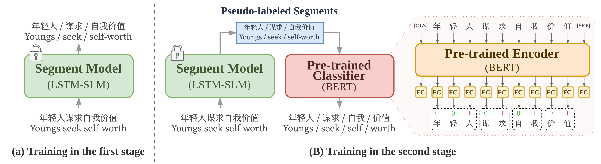

# Improved Unsupervised Chinese Word Segmentation Using Pre-trained Knowledge and Pseudo-labeling Transfer
This repository contains the implementation of a method for improving unsupervised Chinese word segmentation using pre-trained knowledge and pseudo-labeling transfer.



## Introduction
- We focus on the unsupervised Chinese word segmentaion (UCWS), which do need to any human annotation data.
- Our model consists of two modules, the segment model and the pre-trained classifier:
- The segment model trained on the raw corpus without any annotationm in the first training stage.
- The pre-trained classifier learns the word segmentation signal from the pseudo-labels produced by the segment model.
- We evaluate our proposed work on 8 Chinese word segmnetation benchmark dataset, the result outperform the previous SOTA in unsupervised CWS.

## Repository Structure
- `codes`: Contains the code for our two-stage training framework.
- `codes_cws_tool`: Contains the code that utilizes an existing Chinese Word Segmentation (CWS) tool for word segmentation.
- `configs`: Includes the configs of the SLM used in the method.
- `data`: Contains the necessary data files for training and evaluation.
- `install.sh`: Set up the environment and install the necessary dependencies and the dataset.
- `requirements.txt`: Lists the required dependencies to run the code.

## Installation
```bash
# Clone this project.
git clone https://github.com/IKMLab/CWS.git

# Install the dataset and the necessary dependencies. & Create the virtual environment.
bash install.sh
```
-  Once the installation is complete, the virtual environment will be set up, and all the required dependencies and dataset will be installed.
- The Chinese word segmentation benchmark dataset is included in this project, which consists of 8 benchmark datasets for Chinese word segmentation, along with the evaluation script.

## First stage: Train the segment model
- Train the segment model on the raw corpus without any manual annotation.
    - Determine the CWS dataset.
    - Determine the GPU device being employed.
```bash
bash scripts/first_stage.sh as 0
```

## Second stage: Train the classifier
- Convert the word segmentation task as sequence tagging task.
- Train the classifier based on pseudo-labels produced by the segment model.
    - Determine the CWS dataset.
    - Determine the GPU device being employed.
- The classifeir is based on the [BERT](https://huggingface.co/bert-base-chinese).
```bash
bash scrips/second_stage.sh as 0
```

## Read the scores
- Display the best-F-scores of the experiments.
```
python read_score.py --exp_path exp/second_stage
```
- If you want to check the detail of the experiment, all the evaluation results for each checkpoint are logged on tensorboard.
```
tensorboard --logdir exp/second_stage
```
