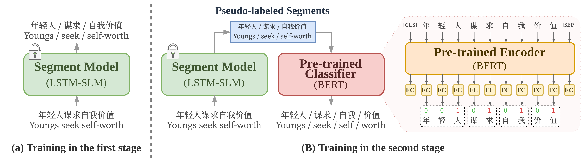

# Improved Unsupervised Chinese Word Segmentation Using Pre-trained Knowledge and Pseudo-labeling Transfer
This is the official implementation of the paper "[Improved Unsupervised Chinese Word Segmentation Using Pre-trained Knowledge and Pseudo-labeling Transfer" (EMNLP 2023)](https://aclanthology.org/2023.emnlp-main.564/)".



> 🌐 **Users in Mainland China / 中國使用者**: If you cannot reach HuggingFace directly, please use a mirror — see [HuggingFace Mirror](#huggingface-mirror-users-in-mainland-china) / [HuggingFace 鏡像站](#huggingface-鏡像站中國大陸使用者).

## Introduction
- We focus on the unsupervised Chinese word segmentaion (UCWS), which do need to any human annotation data.
- Our model consists of two modules, the segment model and the pre-trained classifier:
- The segment model trained on the raw corpus without any annotationm in the first training stage.
- The pre-trained classifier learns the word segmentation signal from the pseudo-labels produced by the segment model.
- We evaluate our proposed work on 8 Chinese word segmnetation benchmark dataset, the result outperform the previous SOTA in unsupervised CWS.

## Repository Structure
- `codes`: Contains the code for our two-stage training framework.
- `codes_cws_tool`: Contains the code that utilizes an existing Chinese Word Segmentation (CWS) tool for word segmentation.
- `configs`: Includes the configs of the SLM used in the method.
- `data`: Contains the necessary data files for training and evaluation.
- `install.sh`: Set up the environment and install the necessary dependencies and the dataset.
- `requirements.txt`: Lists the required dependencies to run the code.

## Installation
```bash
# Clone this project.
git clone git@github.com:IKMLab/ImprovedUCWS-KnowledgeTransfer.git

# Install the dataset and the necessary dependencies. & Create the virtual environment.
bash install.sh
```
-  Once the installation is complete, the virtual environment will be set up, and all the required dependencies and dataset will be installed.
- The Chinese word segmentation benchmark dataset is included in this project, which consists of 8 benchmark datasets for Chinese word segmentation, along with the evaluation script.

## HuggingFace Mirror (Users in Mainland China)
The classifier downloads the [`bert-base-chinese`](https://huggingface.co/bert-base-chinese) model from HuggingFace. If you cannot reach HuggingFace directly (e.g., in Mainland China), set the `HF_ENDPOINT` environment variable to a mirror **before** running any command:
```bash
export HF_ENDPOINT=https://hf-mirror.com
```
This environment variable is read when `transformers`/`huggingface_hub` is imported, so exporting it in your shell before launching the scripts makes it apply to the whole project without modifying any source code.

## HuggingFace 鏡像站 (中國使用者)
本 repo 代碼會從 HuggingFace 下載 [`bert-base-chinese`](https://huggingface.co/bert-base-chinese) 模型。如果你無法直接連線 HuggingFace (例如在中國)，請在執行任何指令**之前**，先把 `HF_ENDPOINT` 環境變數設為鏡像站:
```bash
export HF_ENDPOINT=https://hf-mirror.com
```
這個環境變數會在 `transformers`/`huggingface_hub` 被 import 時讀取，因此只要在啟動腳本前於 shell 設定好，就能套用到整個專案，而不需要修改任何原始程式碼。

## First stage: Train the segment model
- Train the segment model on the raw corpus without any manual annotation.
    - Determine the CWS dataset.
    - Determine the GPU device being employed.
```bash
bash scripts/first_stage.sh as 0
```

## Second stage: Train the classifier
- Convert the word segmentation task as sequence tagging task.
- Train the classifier based on pseudo-labels produced by the segment model.
    - Determine the CWS dataset.
    - Determine the GPU device being employed.
- The classifeir is based on the [BERT](https://huggingface.co/bert-base-chinese).
```bash
bash scripts/second_stage.sh as 0
```

## Read the scores
- Display the best-F-scores of the experiments.
```
python read_score.py --exp_path exp/second_stage
```
- If you want to check the detail of the experiment, all the evaluation results for each checkpoint are logged on tensorboard.
```
tensorboard --logdir exp/second_stage
```

## Platform Notes

This repository was developed and tested primarily on Linux.
We recommend using Linux or WSL2 for reproduction.

The evaluation script relies on the official CWS Perl scoring script (`score.pl`).
Native Windows execution may require additional Perl configuration and can cause encoding or path-related issues.
We currently do not officially support native Windows execution.


## Cite our paper
If you find our work useful in your research, please consider citing our paper:
```
@inproceedings{li-etal-2023-improved,
    title = "Improved Unsupervised {C}hinese Word Segmentation Using Pre-trained Knowledge and Pseudo-labeling Transfer",
    author = "Li, Hsiu-Wen  and
      Lin, Ying-Jia  and
      Li, Yi-Ting  and
      Lin, Chun  and
      Kao, Hung-Yu",
    editor = "Bouamor, Houda  and
      Pino, Juan  and
      Bali, Kalika",
    booktitle = "Proceedings of the 2023 Conference on Empirical Methods in Natural Language Processing",
    month = dec,
    year = "2023",
    address = "Singapore",
    publisher = "Association for Computational Linguistics",
    url = "https://aclanthology.org/2023.emnlp-main.564/",
    doi = "10.18653/v1/2023.emnlp-main.564",
    pages = "9109--9118",
    abstract = "Unsupervised Chinese word segmentation (UCWS) has made progress by incorporating linguistic knowledge from pre-trained language models using parameter-free probing techniques. However, such approaches suffer from increased training time due to the need for multiple inferences using a pre-trained language model to perform word segmentation. This work introduces a novel way to enhance UCWS performance while maintaining training efficiency. Our proposed method integrates the segmentation signal from the unsupervised segmental language model to the pre-trained BERT classifier under a pseudo-labeling framework. Experimental results demonstrate that our approach achieves state-of-the-art performance on the eight UCWS tasks while considerably reducing the training time compared to previous approaches."
}
```